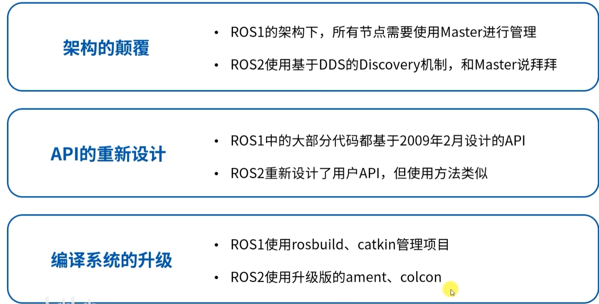
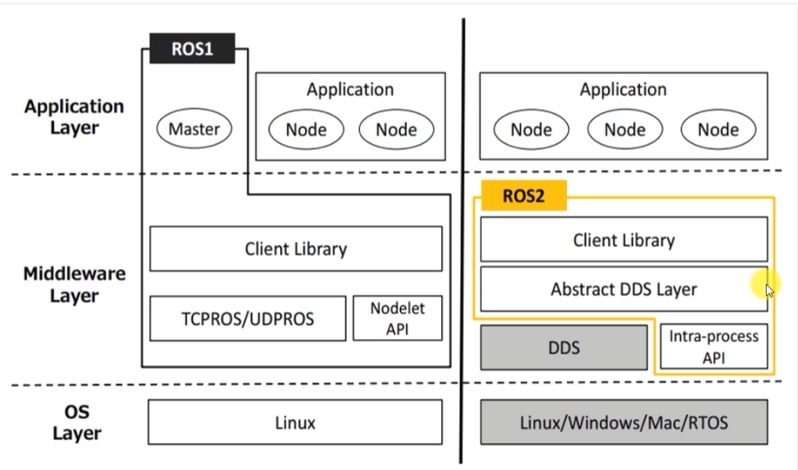
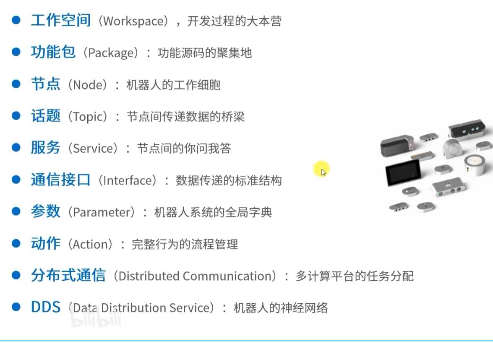

# ROS入门简介

***

***

ROS（Rebot Operating System，机器人操作系统）：为了便于机器人研究与开发，设计的一种通用的开发框架。其作用为让分散式的部件之间进行通信。严格意义上说ROS只是一套通信框架。

更为准确的说ROS是一个为机器人开发提供通信机制、工具、软件包管理、调试工具和标准接口的“机器人软件开发平台”。

机器人通常由很多模块组成，例如：

- 底盘运动控制 &#x20;
- 激光雷达 &#x20;
- 摄像头 &#x20;
- IMU &#x20;
- 路径规划 &#x20;
- 建图 &#x20;
- 定位 &#x20;
- 避障 &#x20;
- 机械臂控制 &#x20;
- 上位机界面 &#x20;

如果没有 ROS，每个模块之间如何传数据、如何启动、如何调试、如何复用，都要自己设计。ROS 的作用就是把这些常用问题标准化。

# 概念

## 元操作系统

ROS 常被称为**Meta Operating System，元操作系统**。

这里的“元”可以理解为：

> 它不是直接管理硬件的操作系统，而是在真正的操作系统之上，提供机器人开发所需的系统级能力。

例如 Linux 负责：

- 进程调度 &#x20;
- 文件系统 &#x20;
- 网络通信 &#x20;
- 内存管理 &#x20;
- 硬件驱动 &#x20;

ROS 负责：

- 节点之间通信 &#x20;
- 机器人模块组织 &#x20;
- 消息格式定义 &#x20;
- 参数管理 &#x20;
- 软件包管理 &#x20;
- 日志与调试 &#x20;
- 可视化工具 &#x20;
- 坐标变换 &#x20;
- 机器人算法复用 &#x20;

所以 ROS 更像是：

```markdown 
机器人应用程序
    ↑
ROS 框架
    ↑
Linux / Ubuntu
    ↑
硬件
```


举个例子：

Linux 不知道什么是“激光雷达数据”或“机器人速度指令”，但 ROS 定义了这些常见机器人数据的通信方式。

所以 ROS 被称为“元操作系统”，意思是它在操作系统之上，又抽象出了一套适合机器人开发的系统能力。

## 分布式通信机制

机器人系统通常不是一个程序完成所有功能，而是由很多独立程序组成。

在 ROS 中，这些独立程序叫做**节点 Node**。

例如一个移动机器人可以拆成：

```markdown 
激光雷达节点
摄像头节点
IMU节点
底盘控制节点
定位节点
建图节点
路径规划节点
避障节点
```


这些节点之间需要互相传递数据。

例如：

```markdown 
激光雷达节点  →  发布雷达数据
建图节点      →  订阅雷达数据
定位节点      →  订阅地图和雷达数据
规划节点      →  发布速度指令
底盘节点      →  订阅速度指令并控制电机
```


这就是 ROS 的分布式通信机制。

“分布式”表示：

> 系统中的不同功能模块可以运行在不同进程、不同 CPU、甚至不同电脑上，但它们可以像一个整体一样协同工作。

例如：

```markdown 
电脑A：运行激光雷达驱动、摄像头驱动
电脑B：运行建图、定位、路径规划
电脑C：运行远程监控界面
```


只要它们在同一个网络里，ROS 就可以让它们互相通信。

这对机器人很重要，因为机器人系统复杂，可能需要多台计算设备共同工作。

## 松耦合软件框架

“耦合”可以理解为：

> 模块之间依赖得有多紧。

## 强耦合示例

假设你写了一个程序：

```markdown 
main函数里直接读取雷达
直接处理数据
直接控制电机
直接做路径规划
```


这样所有功能都混在一起。

问题是：

- 雷达换型号，很多代码要改 &#x20;
- 底盘换协议，很多代码要改 &#x20;
- 建图算法换一个，也要改主程序 &#x20;
- 调试困难 &#x20;
- 复用困难 &#x20;

这就是强耦合。

***

## 松耦合示例

在 ROS 中可以这样拆：

```markdown 
雷达驱动节点  → 发布 /scan
建图节点      → 订阅 /scan，发布 /map
定位节点      → 订阅 /scan 和 /map
规划节点      → 发布 /cmd_vel
底盘节点      → 订阅 /cmd_vel
```


每个节点只关心自己的输入和输出。

比如底盘控制节点只需要知道：

```markdown 
我订阅 /cmd_vel
收到速度指令后控制电机
```


它不关心速度指令是人工遥控来的，还是导航算法来的。

这就是松耦合。

ROS并非真正意义上的操作系统，其底层的任务调度/编译/设备驱动主要还是依赖于原生的Ubuntu Linux来完成。可以将其理解为一个软件框架。

## ROS中常见的通信方式

ROS 主要有三种通信方式：

### ① Topic：话题通信

适合连续数据流。

比如：

```markdown 
激光雷达数据
摄像头图像
IMU数据
速度指令
里程计
```


发布者只管发布，订阅者只管接收。

例如：

```markdown 
雷达节点 publish /scan
建图节点 subscribe /scan
```


这就是典型的松耦合通信。

***

### ② Service：服务通信

适合“一问一答”的请求。

例如：

```markdown 
请求保存地图
请求清除代价地图
请求切换模式
请求机械臂回零
```


类似函数调用：

```markdown 
客户端：请帮我保存地图
服务端：保存完成
```


***

### ③ Action：动作通信

适合耗时任务，并且需要过程反馈。

例如：

```markdown 
导航到某个点
机械臂抓取物体
自动充电
执行清扫任务
```


它的特点是：

```markdown 
发送目标 → 执行中反馈 → 最终结果
```


比如机器人导航时，可以不断反馈当前位置和剩余距离。

## 商清示例

以商用清洁机器人为例，可以拆成：

```markdown 
传感器层：
激光雷达节点
深度相机节点
IMU节点
编码器节点
防跌落传感器节点

感知层：
障碍物检测节点
坡道/台阶识别节点
定位节点
建图节点

决策层：
路径规划节点
清扫任务管理节点
避障节点

执行层：
底盘控制节点
刷盘控制节点
吸水电机控制节点
灯带/语音提示节点
```


它们之间通过 ROS 通信：

```markdown 
雷达节点 → /scan
IMU节点 → /imu
编码器节点 → /odom
定位节点 → /robot_pose
规划节点 → /cmd_vel
底盘节点 ← /cmd_vel
```


这样整个机器人系统就像积木一样组合起来。

## ROS1与ROS2区别

- ROS2移除Master
- ROS2新增DDS
- 核心概念未变化
- 编程难度ROS2有所上升



`roscore`就是 ROS1 的中央注册与管理服务，负责让各个节点找到彼此；ROS2 用 `DDS`（**Data Distribution Service，数据分发服务**） 替代了它，因此不再需要`roscore`。



`roscore` 启动后，会同时启动三个核心组件：

```markdown 
roscore
├──  ROS Master （主节点管理器）
├──  Parameter Server （参数服务器）
└──  rosout （日志系统）
```


`roscore` 是单点中心。如果 Master 崩溃，新节点无法加入。

DDS 的通信模型是：

```markdown 
DataWriter  →  Topic  →  DataReader
```


对应到 ROS2 里就是：

```markdown 
Publisher   →  Topic  →  Subscriber
```


也就是：

```markdown 
发布者  →  话题  →  订阅者
```




# ROS2部分概念（简单了解即可）

### DDS的自动发现机制

```markdown title="简单理解"
节点上线
  ↓
发送“自我介绍”
  ↓
其他节点收到
  ↓
检查 Topic 名称和数据类型
  ↓
如果匹配，就建立通信
```


例如：

```markdown 
laser_node:
我发布 /scan，类型 sensor_msgs/msg/LaserScan

slam_node:
我订阅 /scan，类型 sensor_msgs/msg/LaserScan
```


匹配成功：

```markdown 
/scan 名称一致
LaserScan 类型一致
QoS兼容
```


开始通信。

如果不匹配：

```markdown 
Topic 名字不一致
数据类型不一致
QoS不兼容
```


就不会通信。

### Topic：数据通道名称

比如：

```markdown 
/scan
/imu
/odom
/cmd_vel
/battery_state
```


每个 Topic 都有对应的数据类型。

例如：

```markdown 
/scan
类型：sensor_msgs/msg/LaserScan

/cmd_vel
类型：geometry_msgs/msg/Twist

/odom
类型：nav_msgs/msg/Odometry
```


也就是说：

```python 
Topic = 名称 + 数据类型
```


不是只看名字。

### Qos:服务质量

QoS 全称：

```markdown 
Quality of Service
服务质量
```


它决定：

```text 
数据要不要可靠传输
缓存多少数据
数据过期时间
节点断线后如何处理
实时性优先还是可靠性优先
```


ROS2 相比 ROS1 最大的改进之一就是 QoS。

### Reliability：可靠性

Reliability 主要有两种：

```markdown 
Reliable
Best Effort
```


***

#### Reliable：可靠传输

含义：

> 数据必须尽量保证送到。

适合：

```markdown 
急停指令
模式切换
任务指令
地图保存
参数下发
防跌落状态
```


例如：

```markdown 
/estop
/cliff_stop
/mode_switch
```


优点：

```c 
不容易丢数据
```


缺点：

```c 
网络差时可能延迟增加
```


***

#### Best Effort：尽力传输

含义：

> 尽力发送，但不保证每一帧都到。

适合高频传感器数据：

```markdown 
激光雷达
摄像头
点云
IMU
```


例如：

```markdown 
/scan
/camera/image
/points
```


因为这些数据是连续刷新的，偶尔丢一帧影响不大。

优点：

```text 
延迟低
不卡顿
```


缺点：

```c 
可能丢帧
```


## History：历史缓存

History 决定：

```markdown 
订阅者来不及处理时，保留多少帧数据。
```


常见配置：

```markdown 
Keep Last
Keep All
```


***

#### Keep Last

只保留最近 N 帧。

例如：

```text 
Keep Last 10
```


表示最多缓存最近 10 帧。

适合：

```text 
雷达
IMU
速度指令
状态信息
```


***

#### Keep All

尽量保存所有数据。

适合：

```markdown 
日志
重要事件
离线记录
```


但会占用更多内存。

机器人实时系统里一般不轻易使用

## Depth：队列深度

Depth 是 Keep Last 的缓存数量。

例如：

```c 
depth = 10
```


表示：

```html 
最多保留最近10条消息
```


举例：

```text 
激光雷达 20Hz
depth=5
```


如果订阅者短时间处理不过来，最多缓存 5 帧。

## Durability：持久性

Durability 决定：

```text 
新加入的订阅者能不能收到之前发布过的数据。
```


常见：

```text 
Volatile
Transient Local
```


***

#### Volatile

默认方式。

含义：

```text 
只接收订阅之后的新数据
```


例如：

```markdown 
激光雷达数据
IMU数据
速度指令
```


新节点上线之前的数据不会补发。

***

#### Transient Local

含义：

```markdown 
发布者会保存最后一份数据
新订阅者上线后可以立即收到
```


适合：

```markdown 
地图
机器人配置
静态坐标变换
当前工作模式
```


例如`/map`：

```markdown 
地图节点已经发布了地图
RViz后启动
仍然能收到地图
```


## Deadline：截止时间

Deadline 用来表示：

```markdown 
某个 Topic 应该多久更新一次。
```


例如：

```markdown 
底盘状态 /chassis_state
周期 20ms
```


可以设置：

```python 
deadline = 20ms
```


如果超过 20ms 没有新数据，DDS 可以触发回调。

适合检测：

```markdown 
传感器掉线
通信异常
节点卡死
```


## Lifespan：数据寿命

Lifespan 表示：

```text 
一条消息超过多久就过期。
```


例如速度指令：

```markdown 
/cmd_vel
lifespan = 100ms
```


如果这条速度指令超过 100ms 才到，就直接丢弃。

这对机器人很重要。

因为过期的速度指令可能导致危险。

## Liveliness：活跃检测

Liveliness 用来判断：

```c 
发布者是否还活着。
```


例如：

```markdown 
导航节点持续发布 /cmd_vel
```


如果一段时间没有任何活跃声明，就认为节点失联。

适合：

```markdown 
急停
底盘控制
远程遥控
安全监控
```
